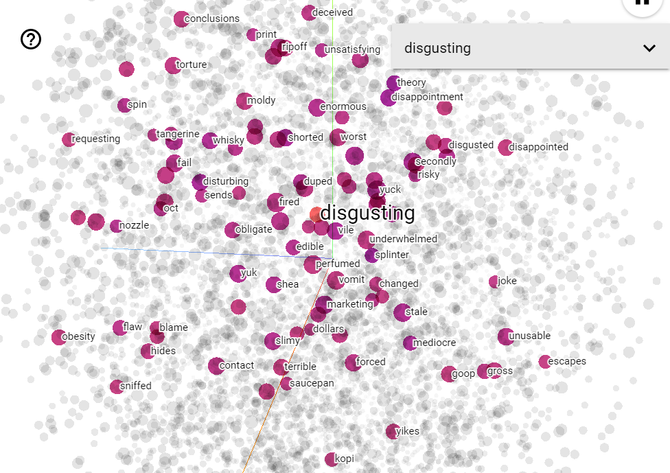
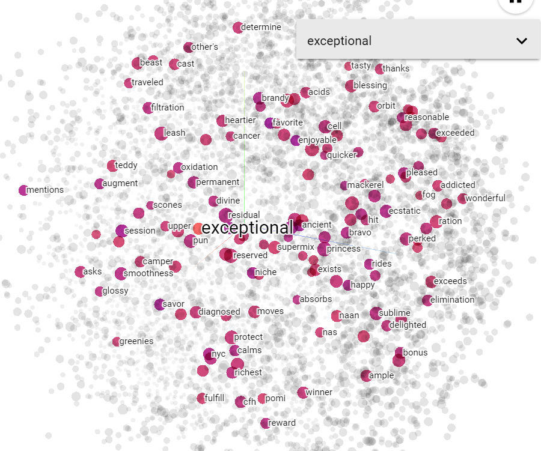

# Food Reviews-Sentiment
An attempt to predict the sentiment of a food review from text using a sequence model

# Dataset used 
The project uses the Amazon fine food reviews dataset which is available on Kaggle
which can be found [here](https://www.kaggle.com/snap/amazon-fine-food-reviews)
  
A few examples from the dataset can be seen below:

#### Positive Examples:
- 
"Great taffy, Great taffy at a great price.  There was a wide assortment of yummy taffy.  Delivery was very quick.  If your a taffy lover, this is a deal."

- 
"Great Irish oatmeal for those in a hurry!,"Instant oatmeal can become soggy the minute the water hits the bowl. McCann's Instant Oatmeal holds its texture, has excellent flavor"

#### Negative Examples:
- 
"Furniture Polish Taste,"Terrible! Artificial lemon taste, like Pledge Lemon Furniture Polish. Don't do this to yourself. Just use plain flake salt and some fresh grated lemon zest."

- 
"I bought this to help me fall asleep and it works although it tastes and smell really bad. Make sure to put this in some sort of a glass jar to prevent your kitchen from stinking."

# Objective 🎯
The objective of the project was to predict whether the review given was a positive one or a negative one. The dataset contains the user rating from 1-5. Ratings above 3 are taken as positive examples (label=1) and the rest are taken as negative examples (label=0).

# Model used

The network uses as an embedding layer of size 64. This is done to represent words in a 64 dimensional space where semantically closer words have a smaller cosine distance. These embeddings are trained by back propagation  

The network is then followed by a bidirectional LSTM. LSTM's have been chosen to help carry out information in sequences from one end to another end. The cell state in the LSTM layer helps in achieving this.  

  
  
  
The network is then followed by a few dense layers with the final one having a sigmoid activation.  

# Results
The model gives a result of **95% training accuracy** and **91% testing accuracy**

# Visualizing Embeddings
The word embeddings for the words in the vocabulary have been trained from scratch.  
Running the notebook produces two files called `vecs.tsv` and `meta.tsv` which are the files containing the embedding vectors and their metadata respectively. These can be uploaded to [tensorflow projector](projector.tensorflow.org).  
Visualizing the embeddings for the vocabulary gives us these:  
  
  
  Negative words like "disgusting", "dissappointed", "disturbing", "terrible", "yuck" and "unacceptable" have been grouped together in the space as they are semantically similar.

Similarly positive words such as "exceptional", "wonderful", "divine", "pleased" and "bravo" have been grouped together.  

Also by observing the visualization we find that positive and negative words are in opposite sides, hence we can assume safely that the semantics have been captured

# Instructions 📝
- Clone the repository
- Download the dataset from [here](https://www.kaggle.com/snap/amazon-fine-food-reviews) into the same directory as the cloned repo
- Open Anaconda prompt and cd into the repo
- Run `conda env create -f environment.yml`
- Run `conda activate tensorflow-cpu`
- Run `jupyter notebook`
- Run the notebook LSTM.ipynb
- Training for 10 epochs gives the desired accuracy.

# Libraries used
- [NumPy](numpy.org)
- [Tensorflow](www.tensorflow.org)
- [Pandas](pandas.pydata.org)
- [Keras](keras.io)
- [scikit-learn](scikit-learn.org)

# Acknowledgments
- Andrew NG's sequence models course on Coursera  
https://www.coursera.org/learn/nlp-sequence-models

- Tensorflow tutorial for word embeddings  
https://www.tensorflow.org/tutorials/text/word_embeddings
