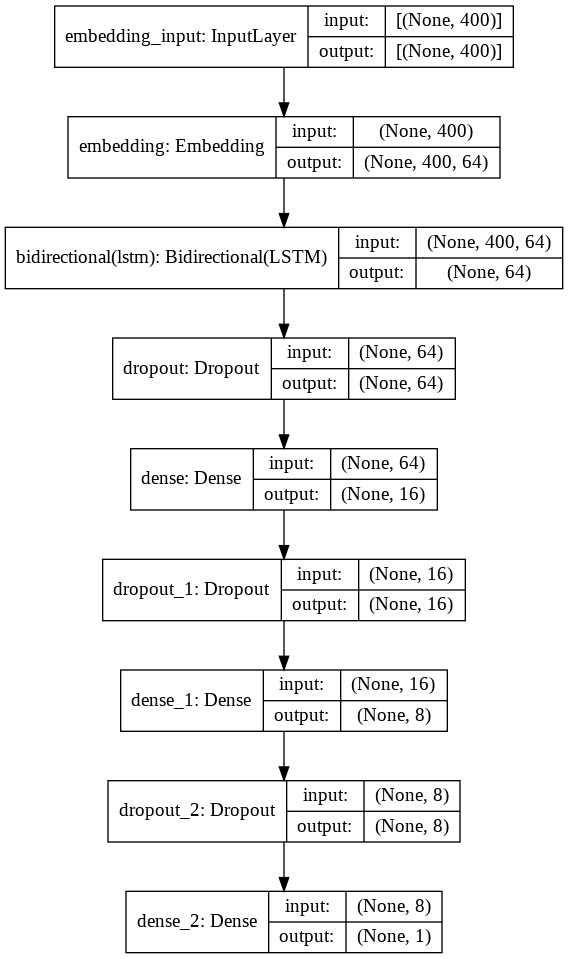

# Food Reviews 🍞 🍔
An attempt to predict the sentiment of a food review from text using a sequence model

# Dataset used 
The project uses the Amazon fine food reviews dataset which is available on Kaggle
which can be found [here](https://www.kaggle.com/snap/amazon-fine-food-reviews)
  

# Objective 🎯
The objective of the project was to predict whether the review given was a positive one or a negative one. The dataset contains the user rating from 1-5. Ratings above 3 are taken as positive examples (label=1) and the rest are taken as negative examples (label=0).

# Model used

The network uses as an embedding layer of size 64. This is done to represent words in a 64 dimensional space where semantically closer words have a smaller cosine distance. These embeddings are trained by back propagation

The network is then followed by a bidirectional LSTM. LSTM's have been chosen to help carry out information in sequences from one end to another end. The cell state in the LSTM layer helps in achieving this.

The network is then followed by a few dense layers with the final one having a sigmoid activation.

(insert model image here)

# Results
The model gives a result of **95% training accuracy** and **91% testing accuracy**

# Instructions 📝
- Clone the repository
- Download the dataset from [here](https://www.kaggle.com/snap/amazon-fine-food-reviews) into the same directory as the cloned repo
- Open Anaconda prompt and cd into the repo
- Run [`conda env create -f environment.yml`](#code)
- Run [`jupyter notebook`](#code)
- Run the notebook LSTM.ipynb
- Training for 10 epochs gives the desired accuracy.

# Acknowledgments
- Andrew NG's sequence models course on Coursera  
https://www.coursera.org/learn/nlp-sequence-models

- Tensorflow tutorial for word embeddings  
https://www.tensorflow.org/tutorials/text/word_embeddings
